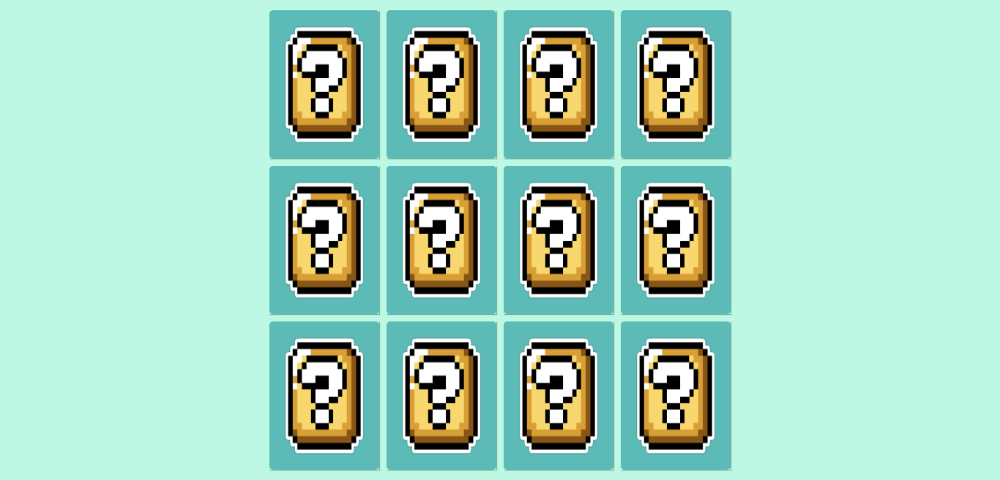

<h1 align="center">🎮 Jogo da Memória do Super Mario 🍄</h1>

<h3 align="center">Projeto de um Jogo da Memória que foi desenvolvido no Bootcamp de Front-End da DIO.</h3>

 

  

    

Acesse o projeto [aqui](https://fel1324.github.io/jogo-da-memoria/)

 

## 👾 Tecnologias

* HTML e CSS
* Javascript
* Git e Github

 

## 🕹️ Projeto

O projeto é um Jogo da Memória inspirado no clássico Game do Super Mario. 

 

## 📝 Licença

Esse projeto está sob a licença MIT.

 

---

 

## Oi, tudo bem? Chegou aqui através do curso, certo? 🙃

Esse é o repositório da nossa aula de Javascript, na qual vamos fazer um jogo da memória com a temática de Super Mario! 

### Os requisitos são:

* [HTML básico](https://www.w3schools.com/html/)
* [CSS básico](https://developer.mozilla.org/pt-BR/docs/Web/CSS)
* [Javascript básico](https://developer.mozilla.org/pt-BR/docs/Web/JavaScript)
 
## 🚀 Let's code! 🚀
